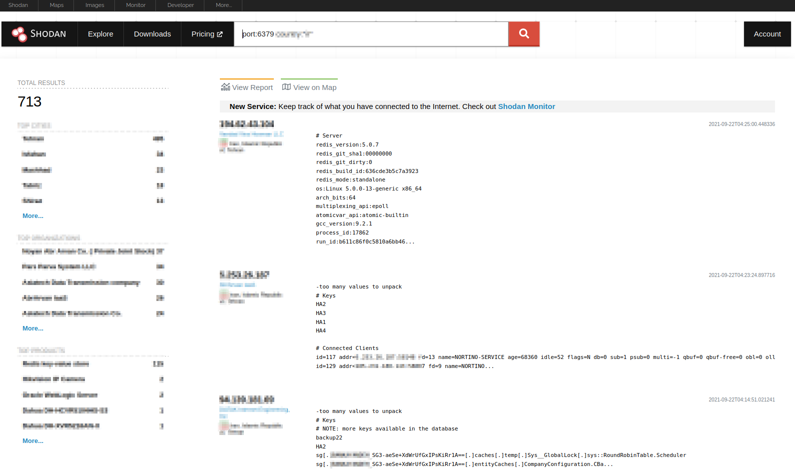
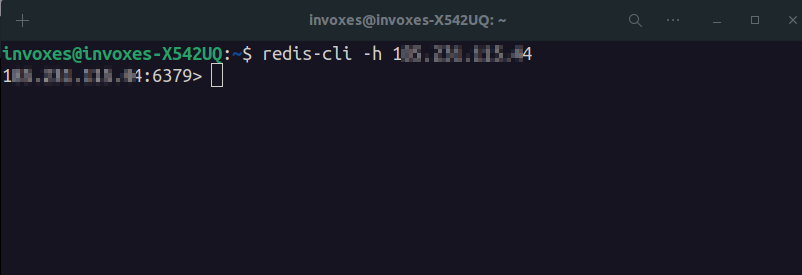
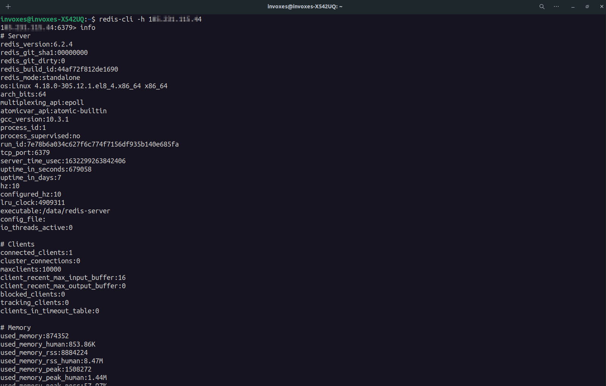
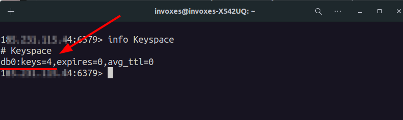
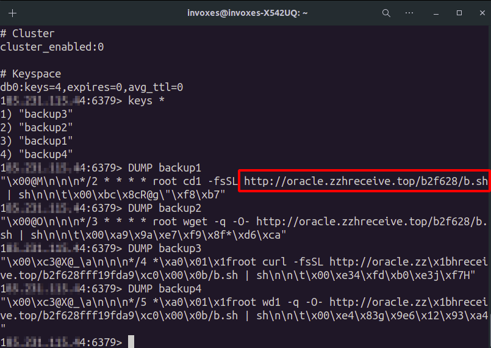
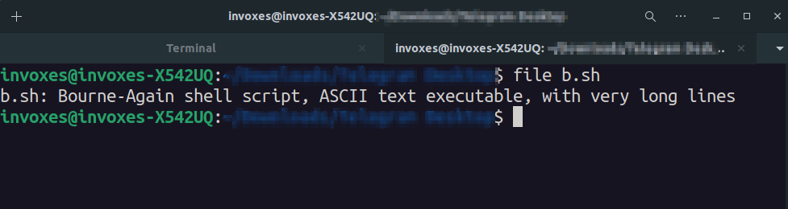
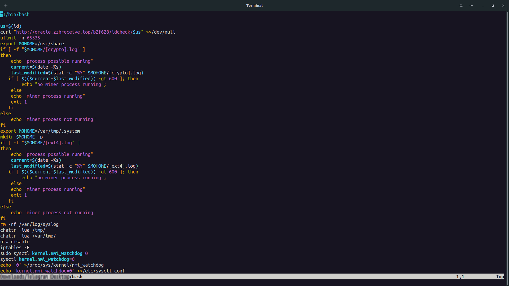

# TeamTNT Miners in the Wild

Last night Me and My friend were Looking for some Redis NOSQL (Because Most of them does not have any aunthetication ofcourse 😆) in Shodan and Censys for Bug Hunting.

I've found some interested which led me to write this blog post.

Most of the Redis seemed to be exploited and infected with a Miner by TeamTNT.

I used shodan query `port:6379` to find Redis services.

Redis has a tool called `redis-cli` which let you interact with Redis servers.
I used it to connect Redis servers to find vulnerabilities and sensitive data for bug hunting report.
To connect a Redis server you can use `redis-cli -h [Redis Server IP]`.

Redis is a **Key-Value** NOSQL Database that store data **in-memory**, We can find information about Redis state and OS with `info` command.
If you want to see just the Keyspace part (Information about Keys and DBs), Use `info Keyspace`.

It has a **db0** and **4 Key**. We can dump keys with `DUMP`, Also you can use `MGET` if `DUMP` didn't work. (Bypass Technique?!😃)

We can see there is a URL that requested by **cURL**. I've downloaded the file and used `file` command to determine what kind of file this is.

It as 1488 lines of code 😐. I've analyzed some parts of this bash script and I'll explain some functionalities of it.
In the last image you can see line 4 send output of `id` command to Hackers C2. Also in the next few lines you can see **miner** word multiple times which can be a good indicator we dealing with a CryptoMiner.

After all these, It checks if **Alibaba Cloud Monitoring Service** enabled or not (till line 140). After that it disable **SELINUX**, **AppArmor** and **Aliyun**.
This Bash Malware actually use [THIS SCRIPT](https://github.com/leitbogioro/Fuck_Aliyun/blob/master/Fuck_Aliyun.sh) for disabling **Alibaba Cloud Monitoring Service**.

After all these functions, There are some URLs with **jpg** extension which are configs and miner and etc.

The first URL (mid.jpg) downloaded and it's a **gzip** file. I've renamed and extracted it, It's compressed by **tar** again, So again decompressed it.

It gives us 2 file named (**[ext4]** and **[ext4.pid]**). The main file is an **ELF** file and pid file is a **JSON** configuration file.

We going further, in line 789 there is a DIA_TAR which is a base64 encoded variable. I've decoded and saved it. It's a gzip file. I've decompressed it and it has 3 files (**diamorphine.c**, **diamorphine.h**, **Makefile**). It's a **ROOTKIT**! Yeahhh!! It has some features like make a process invisible or privilege escalation and etc. It will compile by system as a **so** module and will execute.

After all execution and etc., Malware make a backdoor on victim with SSH.

Now Everything is done for running xmrig. It print a TeamTNT logo and run xmrig miner to mine monero.

The malware also download some other files which i didn't explain them, because i didn't have much time to analyze them. Lazy as f--k.
After setup completed it will download another shell script which is for complete supply chain attack. And it will again download a tool called **pnscan** that is for port scanning.
In a nutshell it's a Miner and RAT for Linux systems. I've uploaded these samples in [**any.run**](https://app.any.run/tasks/0cb2d63d-553e-4663-814f-054f0843346b) and you can download it to analyze it more. Tell me if you found some interested thing.
