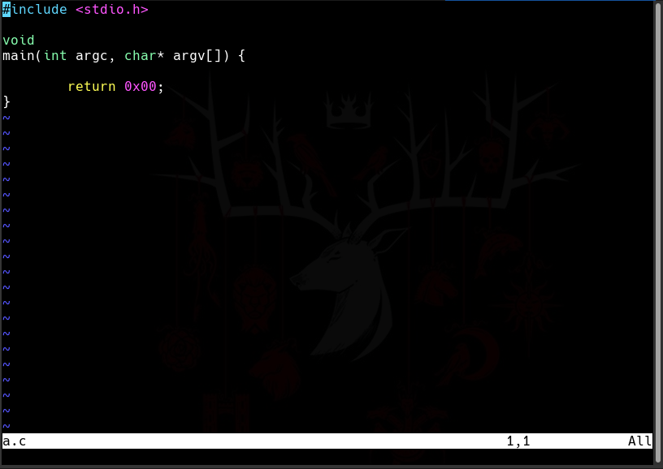

## My First Experience with Neovim

I'm a Vim user but, I love to try new things and this time, I tried Neovim.
Installation is so easy, I'm an Arch Linux user so it is easy as enter below command.

`sudo pacman -S neovim` 

You can check the [Neovim Github](https://github.com/neovim/neovim/wiki/Installing-Neovim) for installation steps.

When it is completed, you can run Neovim by `nvim` command.

As you can see it is so lightweight and a simple colorscheme. I want to install some plugins to make it more fasion.

First of all, I going to install [vim-plug](https://github.com/junegunn/vim-plug) which make easier plugin installation process.

You can simply install it with below command:

`sh -c 'curl -fLo "${XDG_DATA_HOME:-$HOME/.local/share}"/nvim/site/autoload/plug.vim --create-dirs \
    https://raw.githubusercontent.com/junegunn/vim-plug/master/plug.vim'`
